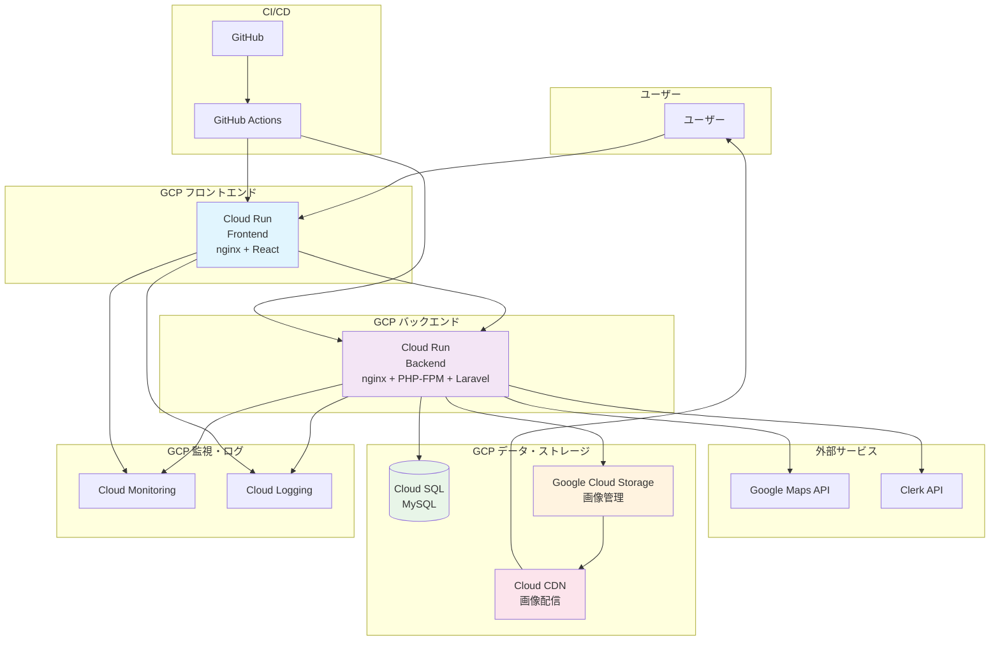

# 500_インフラ構成図

## 目的
本ドキュメントは、TraMemoプロジェクトのGCPインフラ構成を体系的にまとめ、開発・運用・保守の指針とすることを目的とします。

---

## 1. システム構成概要
※後ほど、リファクタ

### 1.1 採用サービス詳細

| サービス | 用途 | 料金（概算） |
|----------|------|-------------|
| Cloud Run | Laravelアプリケーション実行 | 月200万リクエスト無料 |
| Cloud SQL | MySQLデータベース | 月1GB無料 |
| Cloud Storage | 画像ファイル保存 | 月5GB無料 |
| Cloud CDN | 静的ファイル配信 | 月1GB無料 |
| Cloud Load Balancing | ロードバランサー | 月5ルール無料 |


### 1.2 システム構成図


---

## 2. 各コンポーネント詳細

### 2.1 フロントエンド（Cloud Run）
- **サービス**: Cloud Run
- **技術スタック**: nginx + React（ビルド済み）
- **役割**: 静的ファイル配信、SPA（Single Page Application）
- **スケーリング**: オートスケール（0-1000インスタンス）
- **メモリ**: 512MB-2GB
- **CPU**: 1-2 vCPU

### 2.2 バックエンド（Cloud Run）
- **サービス**: Cloud Run
- **技術スタック**: nginx + PHP-FPM + Laravel
- **役割**: APIサーバー、ビジネスロジック処理
- **スケーリング**: オートスケール（0-10インスタンス）
- **メモリ**: 1-4GB
- **CPU**: 1-4 vCPU

### 2.3 データベース（Cloud SQL）
- **サービス**: Cloud SQL for MySQL
- **バージョン**: MySQL 8.0
- **インスタンス**: db-f1-micro
- **接続方式**: Cloud SQL Auth Proxy
- **バックアップ**: 自動バックアップ（7日間）

### 2.4 ストレージ（Google Cloud Storage）
- **サービス**: Google Cloud Storage
- **用途**: 画像ファイル保存
- **バケット**: travel-memory-images
- **アクセス制御**: 署名付きURL
- **ライフサイクル**: 30日後にStandard→Nearline

### 2.5 CDN（Cloud CDN）
- **サービス**: Cloud CDN
- **用途**: 画像配信の高速化
- **キャッシュ**: 1時間（画像ファイル）
- **エッジロケーション**: 自動選択

---

## 3. 通信・セキュリティ

### 3.1 ネットワーク構成
- **VPC**: デフォルトVPC
- **Cloud Run → Cloud SQL**: VPCコネクタ経由（推奨）
- **Cloud Run → GCS**: サービスアカウント認証
- **外部API**: HTTPS通信

### 3.2 セキュリティ設定
- **Cloud SQL**: パブリックIP無効、Cloud SQL Auth Proxy推奨
- **GCS**: バケットレベルでのIAM制御
- **Cloud Run**: サービスアカウント権限最小化
- **API**: CORS設定、レート制限

---

## 4. CI/CD（GitHub Actions）

### 4.1 デプロイフロー
```yaml
# .github/workflows/deploy.yml
name: Deploy to GCP
on:
  push:
    branches: [main]
jobs:
  deploy-frontend:
    # フロントエンドデプロイ
  deploy-backend:
    # バックエンドデプロイ
```

### 4.2 環境変数管理
- **GitHub Secrets**: GCP認証情報、APIキー
- **Cloud Run**: 環境変数設定
- **Cloud SQL**: 接続情報

---

## 5. 監視・ログ

### 5.1 Cloud Monitoring
- **メトリクス**: CPU使用率、メモリ使用率、リクエスト数
- **アラート**: エラー率5%以上、レスポンス時間1秒以上
- **ダッシュボード**: サービス別メトリクス表示

### 5.2 Cloud Logging
- **ログレベル**: INFO, WARNING, ERROR
- **ログ保持**: 30日間
- **エクスポート**: BigQuery（分析用）

---

## 6. 外部API連携

### 6.1 Google Maps API
- **用途**: 地図表示、位置情報取得
- **認証**: APIキー
- **制限**: 月間リクエスト数制限

### 6.2 Clerk API
- **用途**: ユーザー認証・管理
- **認証**: JWTトークン
- **Webhook**: ユーザー作成・更新イベント

---

## 7. 推奨設定・ベストプラクティス

### 7.1 セキュリティ
- Cloud SQL Auth Proxyの利用
- サービスアカウントの権限最小化
- GCSバケットの公開アクセス無効化
- APIキーの定期的なローテーション

### 7.2 パフォーマンス
- Cloud CDNの活用
- 画像の最適化（WebP変換）
- データベースクエリの最適化
- Cloud Runの適切なリソース設定

### 7.3 コスト最適化
- Cloud Runの最小インスタンス数設定
- Cloud SQLの適切なインスタンスサイズ
- GCSのライフサイクル管理
- 不要なリソースの削除

---

## 8. 今後の拡張性

### 8.1 ドメイン・SSL
- Cloud Load Balancing + SSL証明書（マネージド）
- 独自ドメインの設定
- カスタムドメインのマッピング

### 8.2 スケーラビリティ
- Cloud Runのリージョン展開
- Cloud SQLのリードレプリカ
- Cloud CDNのグローバル展開

### 8.3 監視・アラート
- Sentry連携（エラー監視）
- Slack通知（アラート）
- カスタムメトリクスの追加

---

## 9. 参考リンク
- [Cloud Run公式ドキュメント](https://cloud.google.com/run/docs)
- [Cloud SQL公式ドキュメント](https://cloud.google.com/sql/docs)
- [Cloud Storage公式ドキュメント](https://cloud.google.com/storage/docs)
- [Cloud CDN公式ドキュメント](https://cloud.google.com/cdn/docs)

---

*（最終更新日: 2024-07-xx）* 