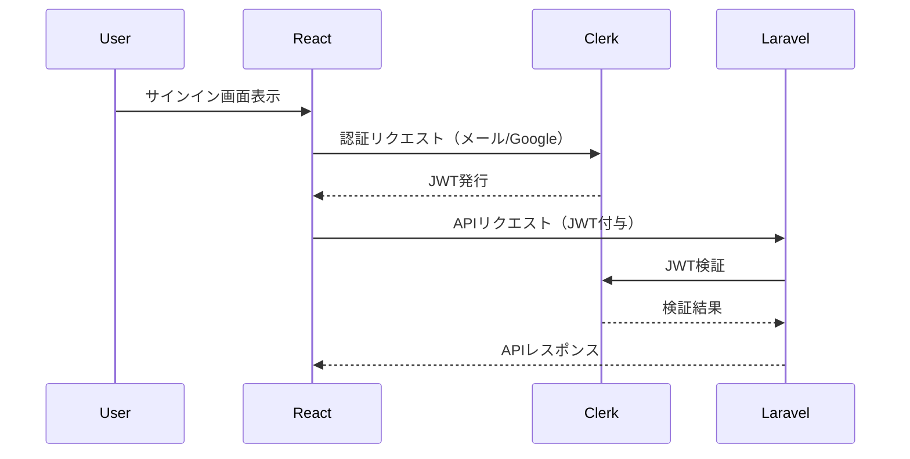

# 600_認証設計_Clerk採用.md

## 目的
本ドキュメントは、Travel Memoryプロジェクトにおける認証機能の設計方針をまとめたものです。Clerkを認証基盤とし、フロントエンド（React）・バックエンド（Laravel）双方の実装指針を明確にします。

---

## 1. 採用技術と役割
| 技術      | 役割                                      |
|-----------|-------------------------------------------|
| Clerk     | 認証基盤（メール認証、Google認証、ユーザー管理） |
| React     | フロントエンド、ClerkのUIコンポーネント利用    |
| Laravel   | バックエンドAPI、ユーザーデータの一部管理         |

---

## 2. 認証方式
- メール認証（Clerk標準）
- Google認証（Clerk標準）
- Twitter認証（Clerk・Twitter仕様次第、将来対応）
- メール認証のVerifyはClerkで自動対応

---

## 3. ユーザー情報の管理方針
- 一次管理：Clerk（プロフィール、SNS連携情報、メール認証状態など）
- Laravel側DB：clerk_user_idをキーにアプリ独自情報を管理
- ユーザー情報の同期：初回ログイン時やプロフィール更新時に必要な情報のみLaravel側に保存・更新

---

## 4. システム構成・認証フロー
### 4.1 フロントエンド（React）
- Clerk公式SDK・UIコンポーネントを利用し、認証画面・ユーザー管理画面を実装
- 認証後、Clerkから発行されるJWT（IDトークン）を取得
- APIリクエスト時、JWTをHTTPヘッダー（Authorization: Bearer xxx）に付与

### 4.2 バックエンド（Laravel）
- 受信したJWTをClerkの公開鍵で検証し、認証済みユーザーのみAPI利用を許可
- JWT内のsub（ClerkユーザーID）をもとにusersテーブルを参照・登録
- アプリ独自のユーザーデータはLaravel側で管理

---

## 5. 実装ポイント
### 5.1 React側
- Clerk公式ドキュメントに従い、<SignIn />や<UserButton />等のコンポーネントを利用
- 認証状態やユーザー情報はClerk SDK経由で取得
- API通信時はgetToken()で取得したJWTをリクエストヘッダーに付与

### 5.2 Laravel側
- ミドルウェアでJWTの検証を実装（Clerk公式の検証ライブラリ推奨）
- JWTのsubをもとにusersテーブルを検索。なければ新規登録
- 必要に応じて、ユーザー情報の更新・同期処理を実装

---

## 6. 無料枠・コスト
- Clerkの無料枠（5,000MAU）で十分運用可能
- メール送信もClerk経由で完結。追加コストなし
- 商用・大規模展開時は有料プランを検討

---

## 7. 今後の拡張性
- Clerkは他SNS認証やエンタープライズSSO（有料）にも対応
- 将来的な認証方式追加も容易

---

## 8. 注意点・補足
- Twitter認証はClerk側・Twitter側の仕様変更に注意
- Laravel側で独自にメール認証やパスワード管理は不要
- Clerkの障害時は認証全体に影響するため、運用時はステータス監視推奨

---

## 9. 参考リンク
- [Clerk公式ドキュメント](https://clerk.com/docs)
- [Clerk React SDK](https://clerk.com/docs/reference/react)
- [Clerk JWT検証（バックエンド）](https://clerk.com/docs/backend-requests)

---

## 10. 図解（シーケンス図イメージ）
