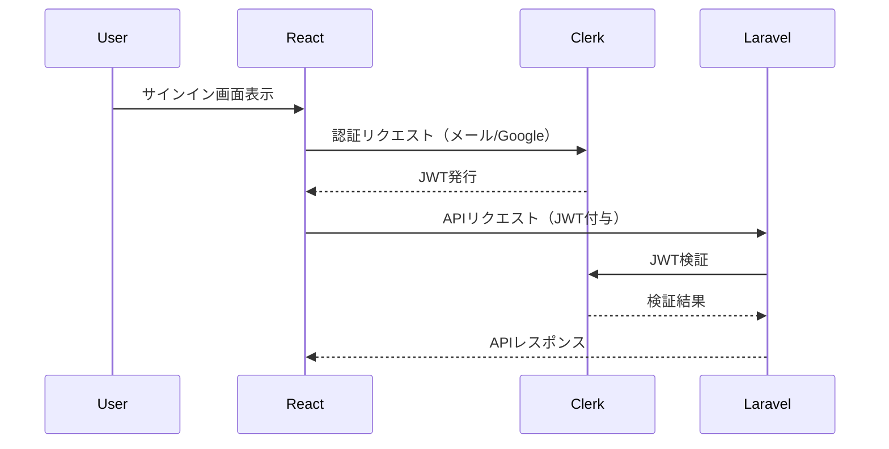

# 認証機能設計書（Clerk採用版）

---

## 概要

本ドキュメントは、Travel Memoryプロジェクトにおける認証機能の設計方針をまとめたものです。  
本設計は、**Clerk**を認証基盤とし、フロントエンド（React）・バックエンド（Laravel）双方の実装指針を記載します。  
AIや追加のプログラマーが参画した際にも理解しやすいよう、構成・役割・連携方法を明確に記述します。

---

## 1. 採用技術と役割

| 技術      | 役割                                      |
|-----------|-------------------------------------------|
| Clerk     | 認証基盤（メール認証、Google認証、ユーザー管理） |
| React     | フロントエンド、ClerkのUIコンポーネント利用    |
| Laravel   | バックエンドAPI、ユーザーデータの一部管理         |

---

## 2. 認証方式

- **メール認証**：Clerkの標準機能を利用
- **Google認証**：Clerkの標準機能を利用
- **Twitter認証**：Clerk側・Twitter側の仕様次第。現時点では「対応できれば追加」扱い
- **メール認証のVerify**：Clerkで自動対応

---

## 3. ユーザー情報の管理方針

- **一次管理**：Clerk（プロフィール、SNS連携情報、メール認証状態など）
- **Laravel側DB**：ClerkのユーザーID（`clerk_user_id`）をキーに、アプリ独自の情報（例：アプリ内プロフィール、投稿数など）を管理
- **ユーザー情報の同期**：初回ログイン時やプロフィール更新時に、必要な情報のみLaravel側に保存・更新

---

## 4. システム構成・認証フロー

### 4.1 フロントエンド（React）

- Clerk公式SDK・UIコンポーネントを利用し、認証画面・ユーザー管理画面を実装
- 認証後、Clerkから発行されるJWT（IDトークン）を取得
- APIリクエスト時、JWTをHTTPヘッダー（例：Authorization: Bearer xxx）に付与

### 4.2 バックエンド（Laravel）

- 受信したJWTをClerkの公開鍵で検証し、認証済みユーザーのみAPI利用を許可
- JWT内の`sub`（ClerkユーザーID）をもとにusersテーブルを参照・登録
- アプリ独自のユーザーデータはLaravel側で管理

---

## 5. 実装ポイント

### 5.1 React側

- Clerkの[公式ドキュメント](https://clerk.com/docs)に従い、`<SignIn />`や`<UserButton />`などのコンポーネントを利用
- 認証状態やユーザー情報はClerkのSDK経由で取得
- API通信時は、`getToken()`で取得したJWTをリクエストヘッダーに付与

### 5.2 Laravel側

- ミドルウェアでJWTの検証を実装（Clerk公式の検証ライブラリ推奨）
- JWTの`sub`をもとにusersテーブルを検索。なければ新規登録
- 必要に応じて、ユーザー情報の更新・同期処理を実装

---

## 6. 無料枠・コスト

- Clerkの無料枠（5,000MAU）で十分運用可能
- メール送信もClerk経由で完結。追加コストなし
- 商用・大規模展開時は有料プランを検討

---

## 7. 今後の拡張性

- Clerkは他SNS認証やエンタープライズSSO（有料）にも対応
- 将来的な認証方式追加も容易

---

## 8. 注意点・補足

- Twitter認証はClerk側・Twitter側の仕様変更に注意
- Laravel側で独自にメール認証やパスワード管理は不要
- Clerkの障害時は認証全体に影響するため、運用時はステータス監視推奨

---

## 9. 参考リンク

- [Clerk公式ドキュメント](https://clerk.com/docs)
- [Clerk React SDK](https://clerk.com/docs/reference/react)
- [Clerk JWT検証（バックエンド）](https://clerk.com/docs/backend-requests)

---

## 10. 図解（シーケンス図イメージ）

